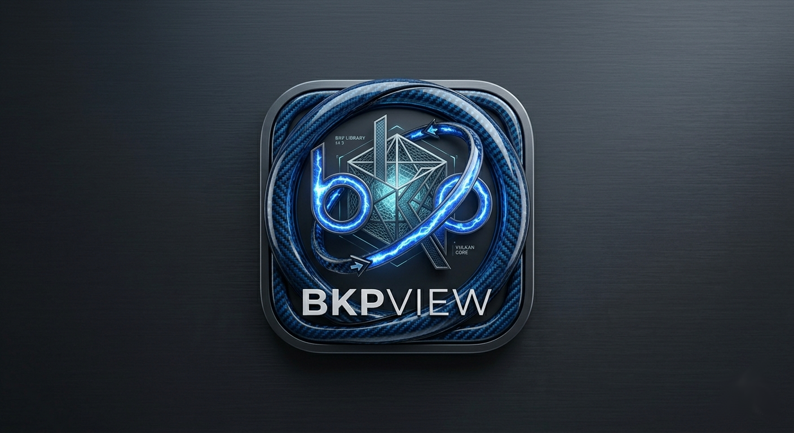

# voltdots

> Hyprland vanilla dotfiles — BKPView theme  
> Dark carbon · Electric blue · GTK only · No Qt



---

## Philosophy

- **Vanilla Hyprland** — no heavy frameworks (no Quickshell, no AGS)
- **GTK only** — no Qt dependencies
- **Machine-agnostic** — `default/` tracked by git, `custom/` stays local
- **Portable** — clone, run `install.sh`, done

---

## Stack

| Role | Tool |
|------|------|
| Compositor | Hyprland 0.45+ |
| Bar | Waybar |
| Launcher | Fuzzel |
| Menus | Wofi |
| Notifications | Swaync |
| Volume/brightness OSD | Swayosd |
| Wallpaper | Swww |
| Lockscreen | Hyprlock |
| Idle management | Hypridle |
| Clipboard | Cliphist |
| Screen capture | Grim + Slurp |
| Screen record | Gpu-screen-recorder |
| Monitor rotation | Wlr-randr |
| Auto-rotate | Iio-sensor-proxy (optional) |
| File manager | Thunar + Nautilus |
| Terminal | Ghostty / Foot / Kitty (configurable) |
| Browser | Firefox / Chromium (configurable) |
| Editor | Codium / Neovim (configurable) |
| Video | Celluloid (mpv frontend) |
| PDF | Zathura |
| Input method | Fcitx5 |
| Network | NetworkManager + nm-applet |
| Bluetooth | Blueman |
| Calendar | Gsimplecal |

---

## Install

```bash
git clone git@github.com:wypifu/voltdots.git ~/.voltdots
cd ~/.voltdots
./install.sh
```

Skip dependency install (if already installed):
```bash
./install.sh --skip-deps
```

---

## Structure
~/.voltdots/
├── hypr/
│   ├── default/          # tracked by git — do not edit directly
│   │   ├── hyprland.conf
│   │   ├── env.conf
│   │   ├── general.conf
│   │   ├── animations.conf
│   │   ├── rules.conf
│   │   ├── keybinds.conf
│   │   ├── execs.conf
│   │   └── defaults.conf
│   └── custom/           # machine-specific — NOT tracked by git
│       ├── env.conf      # auto-generated by install.sh
│       ├── monitors.conf # auto-generated by detect_monitors.sh
│       ├── keybinds.conf # optional overrides
│       ├── rules.conf    # optional overrides
│       ├── execs.conf    # optional autostart
│       └── defaults.conf # preferred apps per machine
├── waybar/
│   ├── default/          # landscape config — tracked by git
│   └── portrait/         # portrait config — tracked by git
├── fuzzel/               # launcher config
├── wofi/                 # dmenu config
├── swaync/default/       # notifications
├── hyprlock/
├── hypridle/
├── swayosd/
├── matugen/
├── scripts/
│   ├── launch_first_available.sh
│   ├── launch_app.sh
│   ├── snip.sh
│   ├── record.sh
│   ├── record_status.sh
│   ├── powermenu.sh
│   ├── switchwall.sh
│   ├── weather.sh
│   ├── actioncenter.sh
│   ├── volumectl.sh
│   ├── rotate.sh
│   ├── confirm_close.sh
│   └── detect_monitors.sh
├── themes/bkpview/
│   └── wallpaper.png
├── install.sh
└── README.md
---

## Machine setup

After running `install.sh`, configure your machine in `~/.voltdots/hypr/custom/` :

### monitors.conf
```ini
# Single monitor
monitor = eDP-1, preferred, auto, 2

# Dual monitor example
monitor = DP-1, 2560x1440@144, 0x0, 1.5
monitor = DP-2, 2560x1440@144, 2560x0, 1.5
```

### defaults.conf
```bash
# Preferred apps — falls back to list in default/defaults.conf
export VOLTTERM="kitty"
export VOLTBROWSER="firefox"
export VOLTEDITOR="codium"

# Wallpaper
export VOLT_WALLPAPER_DIR="$HOME/Pictures/Wallpapers"
export VOLT_WALLPAPER_AUTO=false
export VOLT_WALLPAPER_DELAY=900

# Weather
export VOLT_WEATHER_CITY="Beijing"
export VOLT_WEATHER_CITY2="Lille"
export VOLT_WEATHER_UNIT="metric"
```

---

## Keybinds

| Key | Action |
|-----|--------|
| `Super` | Launcher (fuzzel) |
| `Super + Return` | Terminal |
| `Super + E` | File manager |
| `Super + W` | Browser |
| `Super + C` | Editor |
| `Super + Q` | Close window (confirmation for firefox/terminal/filemanager) |
| `Super + F` | Fullscreen |
| `Super + V` | Toggle floating |
| `Super + S` | Toggle scratchpad |
| `Super + Alt + S` | Move to scratchpad |
| `Super + N` | Notification center |
| `Super + ;` | Clipboard history |
| `Super + Shift + S` | Screenshot region |
| `Super + Shift + R` | Record screen (toggle) |
| `Super + Ctrl + W` | Change wallpaper |
| `Super + Shift + L` | Lock screen |
| `Ctrl + Alt + Delete` | Power menu |
| `Super + 1-0` | Switch workspace |
| `Super + Shift + 1-0` | Move window to workspace |
| `Super + arrows` | Move focus |
| `Super + Shift + arrows` | Move window |
| `Super + Ctrl + arrows` | Resize window |
| `Super + Tab` | Workspace overview |

---

## Theming

BKPView color palette:

| Role | Color |
|------|-------|
| Background | `#0a0c10` |
| Surface | `#141820` |
| Accent | `#1a6cf5` |
| Text | `#c8d3e6` |
| Muted | `#5a8fc2` |
| Highlight | `#7eb8f7` |
| Error | `#f5421a` |
| Warning | `#f5c51a` |

---

## Dependencies

### Arch / EndeavourOS

```bash
# Core
sudo pacman -S --needed hyprland waybar fuzzel wofi swaync awww \
    hyprlock hypridle swayosd

# Capture
sudo pacman -S --needed grim slurp wl-clipboard cliphist

# Rotation
sudo pacman -S --needed wlr-randr iio-sensor-proxy

# Apps
sudo pacman -S --needed thunar nautilus firefox \
    fcitx5 fcitx5-gtk fcitx5-qt \
    blueman network-manager-applet \
    polkit-gnome celluloid zathura \
    gsimplecal brightnessctl playerctl

# Audio
sudo pacman -S --needed pipewire wireplumber

# Fonts & icons
sudo pacman -S --needed ttf-jetbrains-mono-nerd noto-fonts \
    papirus-icon-theme

# CLI tools
sudo pacman -S --needed jq curl libnotify

# AUR
yay -S --needed gpu-screen-recorder
```

### Notes
- `gpu-screen-recorder` — AUR, required for AMD/Nvidia screen recording
- `iio-sensor-proxy` — optional, only needed for auto-rotate on devices with accelerometer
- `gsimplecal` — optional, for interactive calendar on clock click

---

## Machines

| Machine | GPU | Notes |
|---------|-----|-------|
| archmd | RX 6800 | Desktop, 2x4K DP, no rotation needed |
| starlite | Intel UHD | Laptop, single eDP-1, rotation + touch support |
| GPD Pocket 4 | Radeon 890M | Handheld, rotated screen by default |

---

## Credits

Inspired by [end-4/dots-hyprland](https://github.com/end-4/dots-hyprland)  
Built from scratch — GTK only, no Qt
